# 高级数据库系统技术第02次大作业

## 练习一

成绩管理数据库：

+ 学生（学号，姓名，性别，年龄，所在学院，专业名）
+ 课程（课程号，课程名，学时数，课程性质）
+ 选修（学号，课程号，成绩）

用SQL语句描述以下要求：

1. 查询选修了《数据库》课程的学生的姓名

    ```sql
    SELECT 姓名
    FROM 学生 s
    JOIN 选修 a ON a.学号=c.学号
    JOIN 课程 c ON c.课程号=s.课程号
    WHERE c.课程名='数据库';
    ```

2. 查询《数据库》课程的成绩，并按降序排序

    ```sql
    SELECT *
    FROM 选修 a
    JOIN 课程 c ON c.课程号=a.课程号
    WHERE c.课程名='数据库'
    ORDER BY a.成绩 DESC;
    ```

3. 查询没有选修任何课程的学生的学号

    ```sql
    SELECT 学号
    FROM 学生 s
    JOIN 选修 a ON a.学号=s.学号
    WHERE a.成绩 IS NULL;
    ```

4. 查询 c01 号课程成绩最高的分数

    ```sql
    SELECT MAX(成绩)
    FROM 选修
    WHERE 课程号='c01';
    ```

5. 将计算机学院学生的选修记录清空

    ```sql
    DELETE 选修
    FROM 选修 a
    JOIN 学生 s ON s.学号=a.学号
    WHERE s.所在学院='计算机学院';
    ```

6. 将所有必修课的学时数增加 16

    ```sql
    UPDATE 课程
    SET 学时数=学时数+16
    WHERE 课程性质='必修课';
    ```

7. 创建一个视图，用于查询每门课的平均成绩

    ```sql
    CREATE VIEW avg_achi AS (
        SELECT 课程号, 课程名, AVG(成绩)
        FROM 选修 a
        JOIN 课程 c ON c.课程号=a.课程号
        GROUP BY 课程号
    );
    ```

8. 创建一个存储过程，当输入一个学号时返回其选修的课程总数

    ```sql
    CREATE PROCEDURE get_class_account_by_id(IN id INT)
    BEGIN
        SELECT COUNT(课程号)
        FROM 选修
        WHERE 学号=id
    END
    ```

9. 创建一个触发器，当删除一个学生时，同时删除其所有选课信息

    ```sql
    CREATE TRIGGER delete_all_class_when_delete_student
    AFTER DELETE ON 学生
    REFERENCING OLD ROW AS old_row
    FOR EACH ROW
        DELETE FROM 选修
        WHERE 学号=old_row.学号;
    END;
    ```

## 练习二

>   注：此练习使用 MariaDB 11 完成

利用常用RDBMS，访问教材网站 [https://www.db-book.com/](http://www.db-book.com/)，在 Laboratory Material 栏目的 Sample Tables 中获得 University 数据库模式（如 DDL.sql）并导入测试数据集（如 largeRelationsInsertFile.sql）。结合用户需求：

1. 设计至少10个查询（含聚集、连接等，单表查询数量≤3个）

    +   查询所选科目考试成绩为 “A+” 的课程超过 3 门的学生的学号

        ```sql
        SELECT ID FROM takes
        WHERE grade='A'
        GROUP BY ID
        HAVING COUNT(*)>=3;
        ```

        运行结果：

        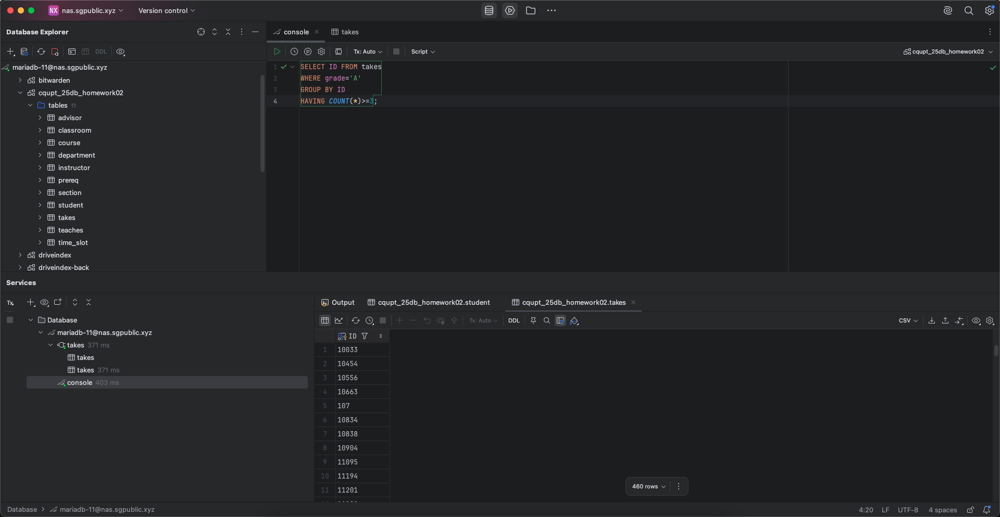

    +   查询每位教师每个学期所教课程数量

        ```sql
        SELECT ID, year, sec_id, COUNT(*) AS count
        FROM teaches
        GROUP BY year, sec_id;
        ```

        运行结果：

        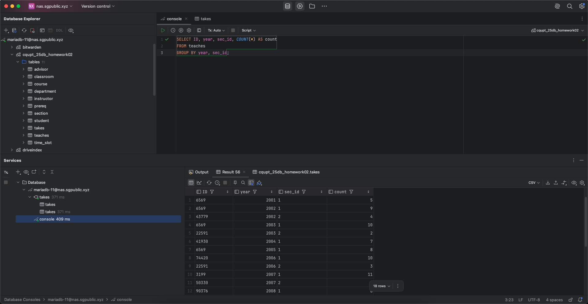

    +   查询办学至今使用次数大于 5 次的教室，并输出使用次数

        ```sql
        SELECT room_number, COUNT(*) AS count
        FROM section
        GROUP BY room_number
        HAVING count >= 5;
        ```

        运行结果：

        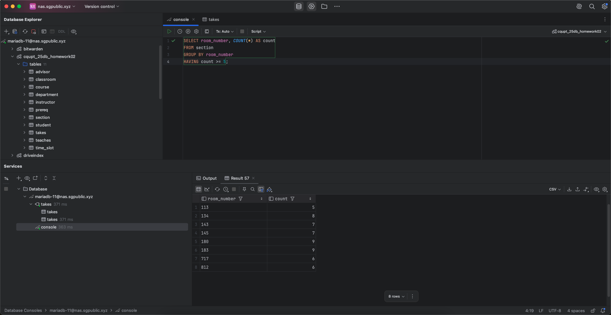

    +   查询能容纳 2008 年所有 “Cybernetics” 学院 “Elastic Structures” 课程考试成绩为 “C-” 的学生的教室信息

        ```sql
        SELECT *
        FROM classroom
        WHERE capacity >= (
            SELECT COUNT(*) AS count
            FROM takes
            WHERE grade='C' AND year=2008 AND course_id=(
                SELECT course_id
                FROM course
                WHERE title='Elastic Structures' AND dept_name='Cybernetics'
            )
        );
        ```

        运行结果：

        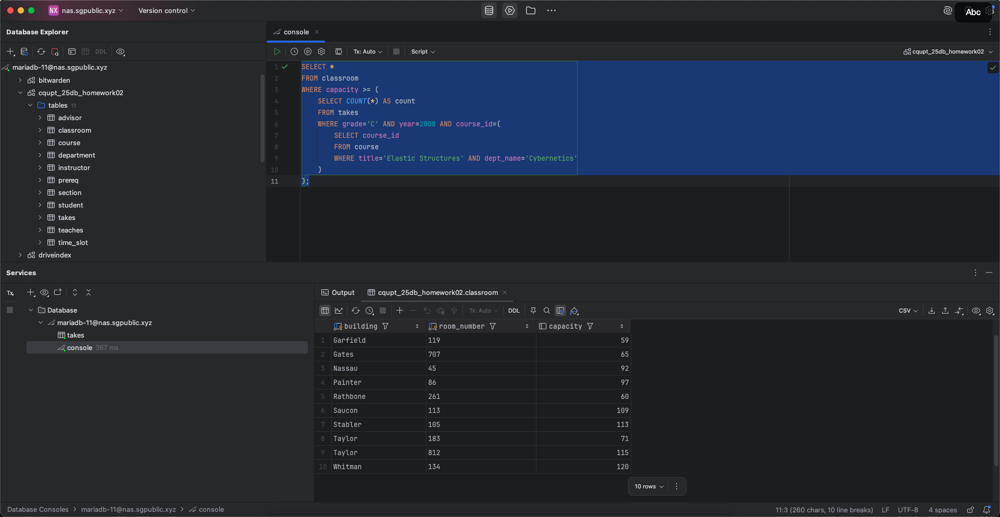

    +   查询预算最高的系及其教师平均工资

        ```sql
        SELECT dept_name, AVG(salary) as avg_salary
        FROM instructor
        WHERE dept_name=(
            SELECT dept_name
            FROM department
            ORDER BY budget DESC
            LIMIT 1
        );
        ```

        运行结果：

        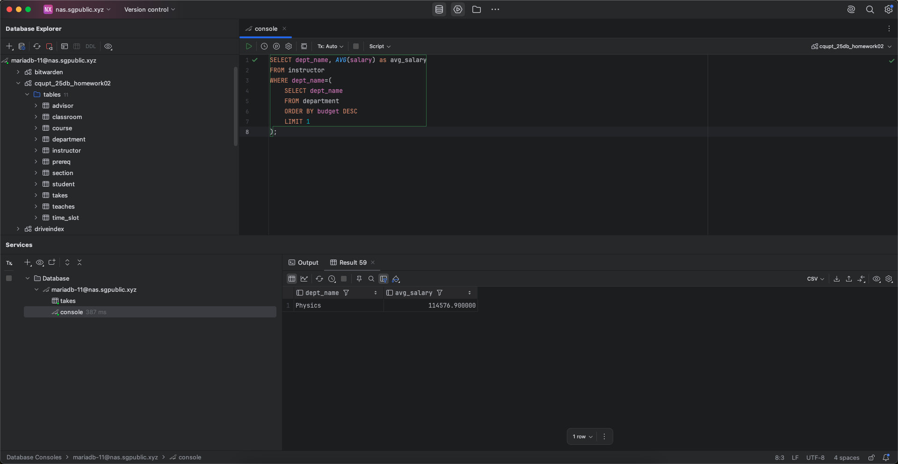

    +   查询得 “A” 成绩最多的学生信息

        ```sql
        SELECT *
        FROM student
        WHERE ID=(
            SELECT s.ID AS count
            FROM student s
            JOIN takes t ON t.ID=s.ID
            WHERE t.grade='A'
            GROUP BY s.ID
            ORDER BY count DESC
            LIMIT 1
        );
        ```

        运行结果：

        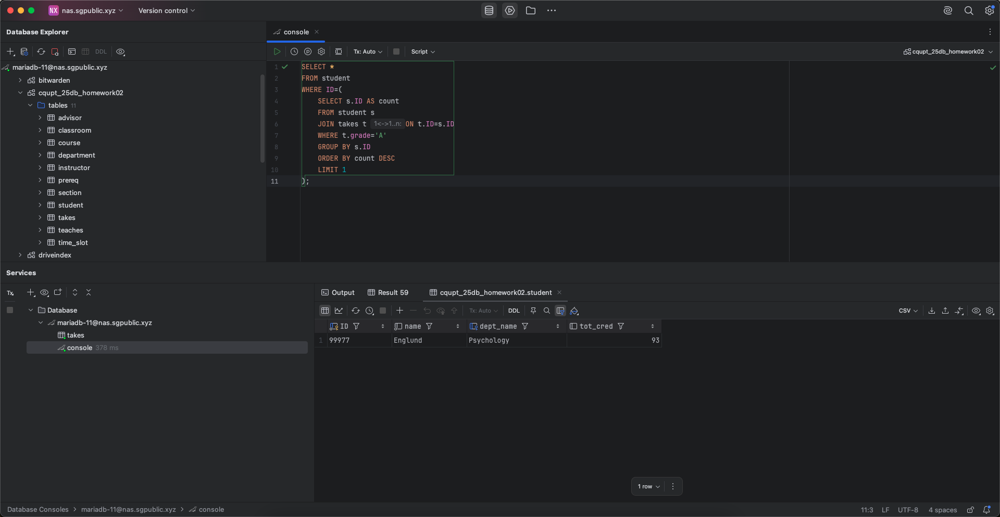

    +   查询指导学生数量最多的导师信息

        ```sql
        SELECT *
        FROM instructor
        WHERE ID=(
            SELECT i_ID
            FROM advisor
            GROUP BY i_ID
            ORDER BY COUNT(*) DESC
            LIMIT 1
        );
        ```

        运行结果：

        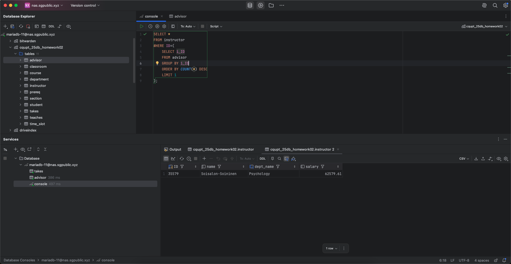

    +   查询有记录的最近一年中所有空闲的教室信息

        ```sql
        SELECT *
        FROM classroom c
        WHERE NOT EXISTS(
            SELECT room_number
            FROM section s1
            WHERE s1.year=(
                SELECT s2.year
                FROM section s2
                ORDER BY s2.year DESC
                LIMIT 1
            ) AND c.room_number=s1.room_number AND c.building=s1.building
        )
        ```

        运行结果：

        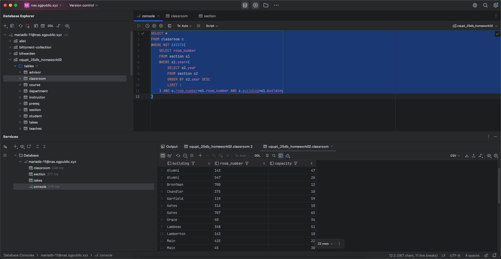

    +   查询周一上午的教学班数量

        ```sql
        SELECT COUNT(*) AS count
        FROM section s
        WHERE EXISTS(
            SELECT 1
            FROM time_slot t
            WHERE start_hr<=12 AND day='M' AND t.time_slot_id=s.time_slot_id
        );
        ```

        运行结果：

        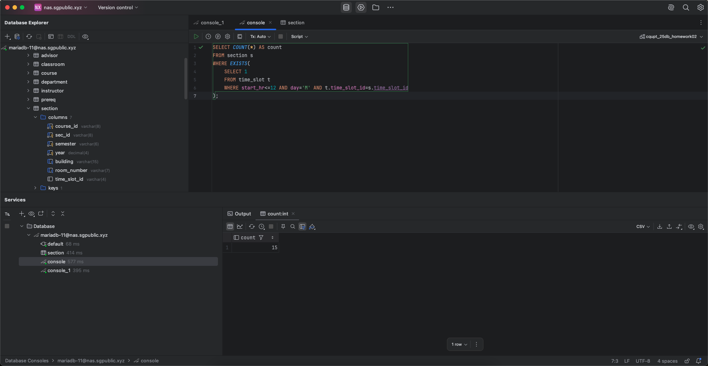

    +   查询学分超过 3 分且没有安排教学班的课程

        ```sql
        SELECT *
        FROM course c
        WHERE NOT EXISTS(
            SELECT 1
            FROM section s
            WHERE s.course_id=c.course_id
        ) AND c.credits >= 3;
        ```

        运行结果：

        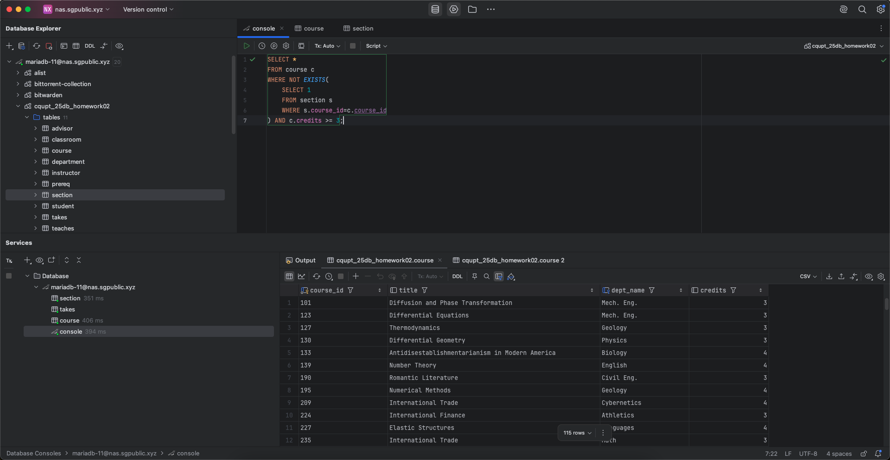

2. 创建至少1个视图，并通过视图查看数据

    ```sql
    CREATE VIEW courses AS
    SELECT *
    FROM course c
    WHERE NOT EXISTS(
        SELECT 1
        FROM section s
        WHERE s.course_id=c.course_id
    ) AND c.credits >= 3;
    ```

   运行结果：

   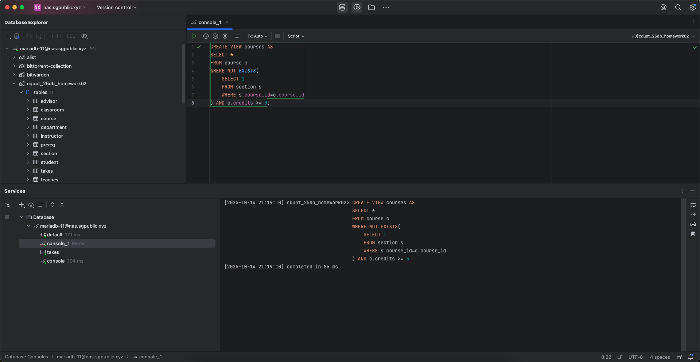

   查看视图：

   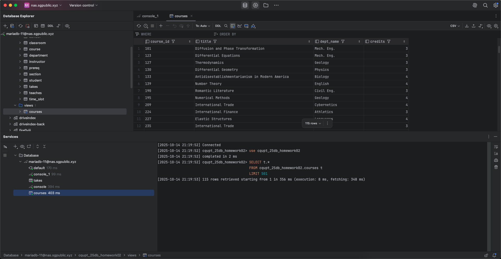

3. 创建至少1个索引，并分析索引创建前后的数据查询效率

   使用查询命令：

    ```sql
    SELECT *
    FROM course c
    WHERE c.credits >= 3 AND NOT EXISTS(
        SELECT 1
        FROM section s
        WHERE s.course_id=c.course_id
    );
    ```

   创建索引前（执行时长 23ms）：

   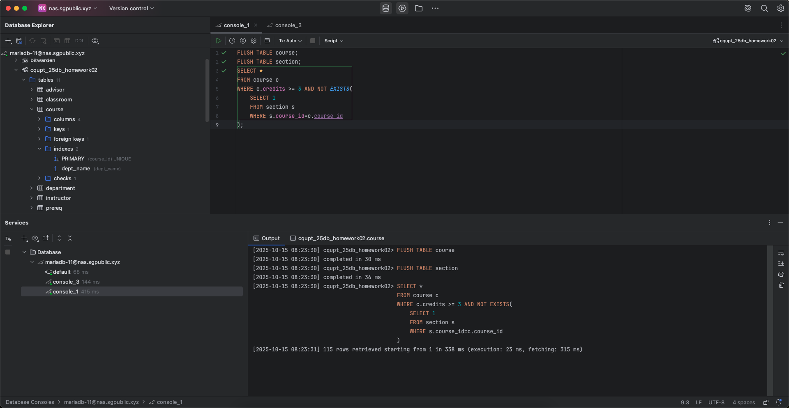

   创建索引：

    ```sql
    CREATE INDEX index_students_name
    ON student (name);
    ```

   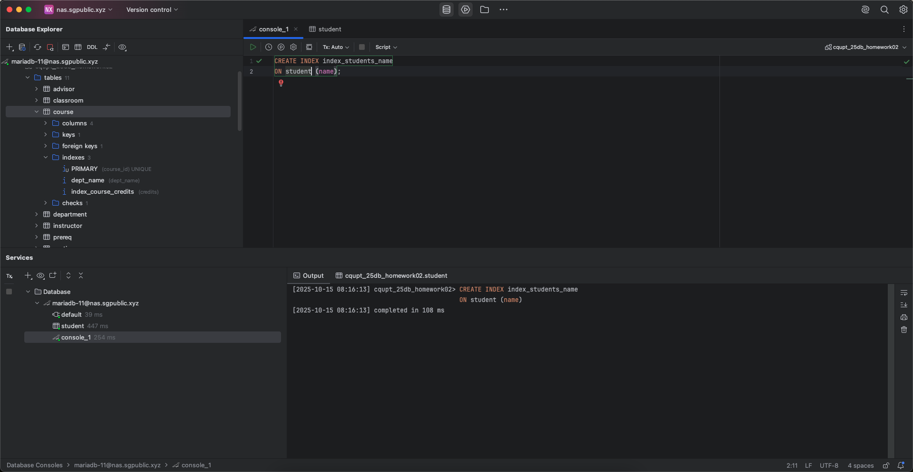

   再次执行（执行时长 6ms，时长显著下降）：

   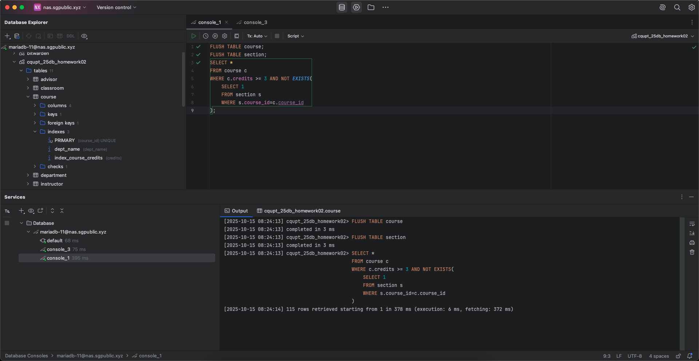

4. 创建至少1个存储过程，并通过调用查看数据

    ```sql
    # 根据星期几查询安排的教学班的数量
    CREATE PROCEDURE check_classroom(IN day_of_week VARCHAR(1))
    BEGIN
        SELECT COUNT(*) AS count
        FROM section s
        WHERE EXISTS(
            SELECT 1
            FROM time_slot t
            WHERE day=day_of_week AND t.time_slot_id=s.time_slot_id
        );
    END;
    ```

   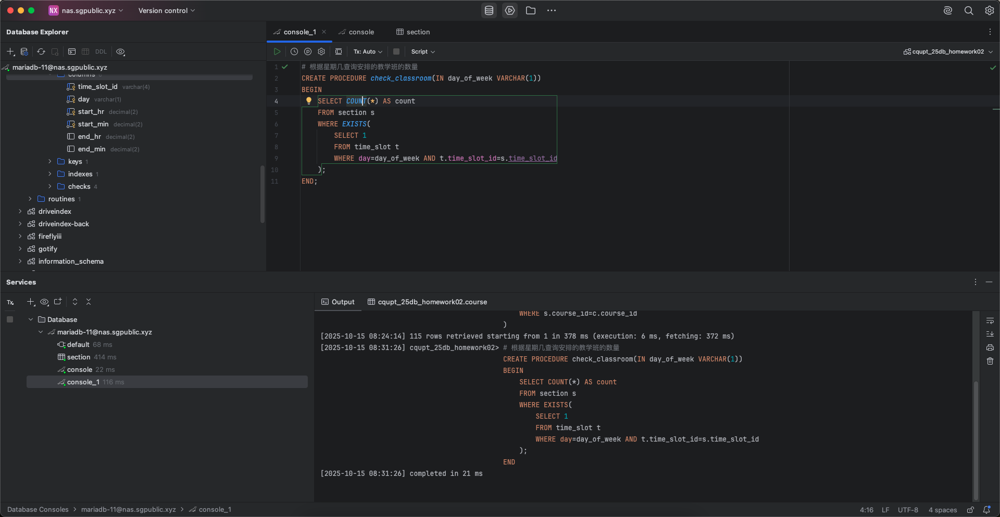

   执行：

    ```sql
    CALL check_classroom('T');
    ```

   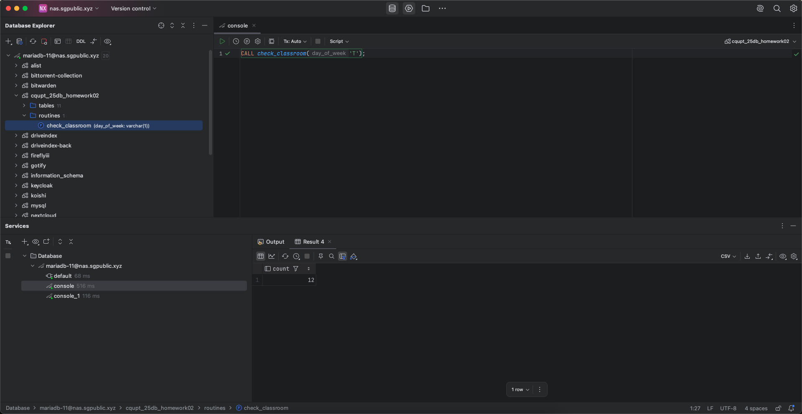

5. 创建至少1个触发器，观察触发器应用结果

    ```sql
    # 当录入学生成绩之后，若成绩为 B 及以上，则为学生增加对应课程的学分，否则什么也不做
    CREATE TRIGGER update_credit_after_takes_insert
    AFTER INSERT ON takes
    FOR EACH ROW
    BEGIN
        IF NEW.grade='B' OR LEFT(NEW.grade, 1)='A' THEN
            UPDATE student
            SET tot_cred=tot_cred+(
                SELECT credits
                FROM course
                WHERE course_id=NEW.course_id
            )
            WHERE ID=NEW.ID;
        END IF;
    END;
    ```

   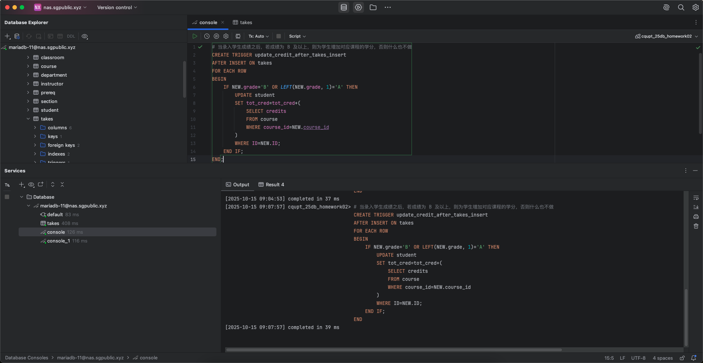

   为 ID 为 1000 的学生执行随机科目成绩录入：

    ```sql
    CREATE PROCEDURE insert_random_takes(IN s_id VARCHAR(5), IN t_grade VARCHAR(2))
    BEGIN
        DECLARE student_dept VARCHAR(20);
    
        SELECT dept_name INTO student_dept
        FROM student
        WHERE ID = s_id;
    
        INSERT INTO takes
        SELECT s_id, c.course_id, s.sec_id, s.semester, s.year, t_grade
        FROM course c
        JOIN section s ON s.course_id=c.course_id
        WHERE dept_name=student_dept AND NOT EXISTS(
            SELECT course_id
            FROM takes t
            WHERE t.course_id=c.course_id AND ID=s_id
        )
        ORDER BY RAND()
        LIMIT 1;
    END;
    CALL insert_random_takes(1000, 'A')
    ```

   执行前：

   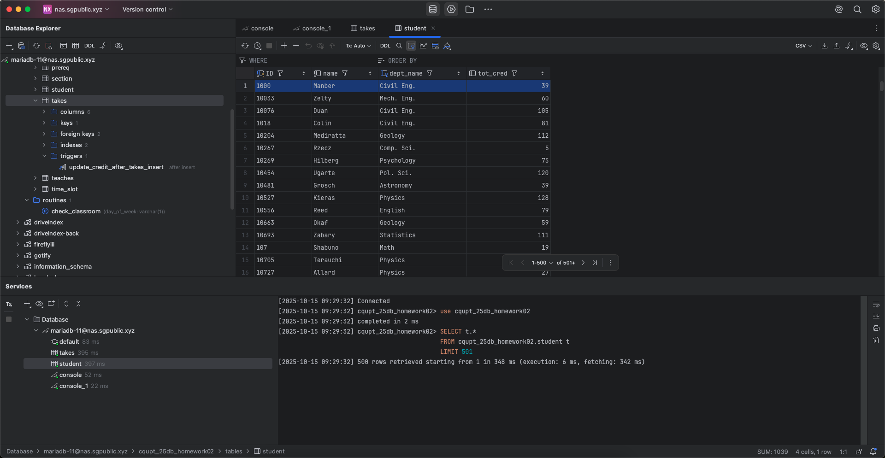

   执行后：

   

6. 用 ER 图给出 University 数据库模式对应的概念模型

   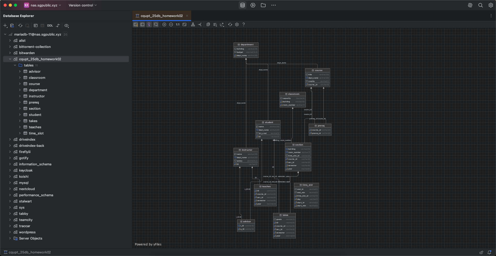