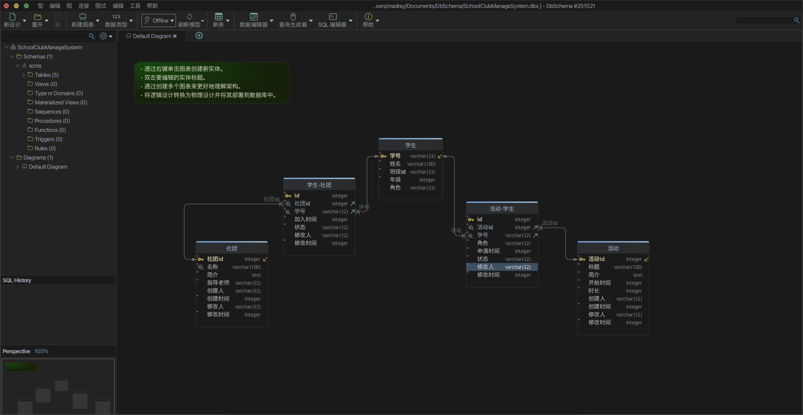
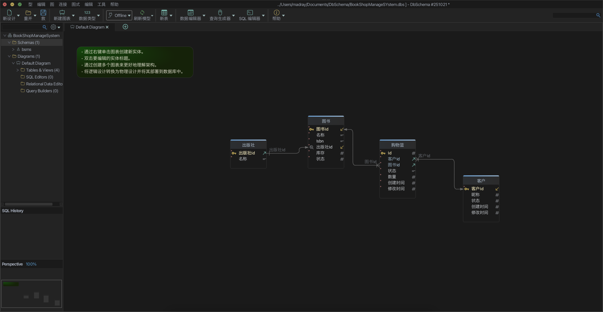

# 高级数据库系统技术第 03 次作业

## 课堂练习

设计 ER 图并转换为关系模式，任选 2 个。

+   连锁超市管理系统（商店、职工、商品、客户）
+   校园社团组织管理系统（社团、学生、活动）
+   医院病患信息管理系统（病房、病床、病人、医生）
+   体育馆运动器材管理系统（器材、供应商、运动员、管理员）
+   科技竞赛信息管理系统（学生、团队、导师、竞赛、项目）
+   网上书店系统（图书、出版社、客户、购物篮）
+   …

### 校园社团组织管理系统

ER 图：

关系模式：

+   学生（<u>学号</u>，姓名，班级，年级，角色）
+   社团（<u>社团ID</u>，名称，简介，指导老师，创建时间，修改时间）
+   活动（<u>活动ID</u>，标题，简介，开始时间，时长，创建人，创建时间，修改人，修改时间）
+   学生-社团（<u>ID</u>，社团ID，学号，加入时间，修改人，修改时间）
+   活动-学生（<u>ID</u>，活动ID，学号，角色，申请时间，状态，修改人，修改时间）

### 网上书店系统

ER 图：

关系模式：

+   图书（<u>图书ID</u>，名称，ISBN，出版社ID，库存，状态）
+   客户（<u>客户ID</u>，昵称，状态，创建时间，修改时间）
+   出版社（<u>出版社ID</u>，名称）
+   购物篮（<u>ID</u>，客户ID，图书ID，状态，数量，创建时间，修改时间）